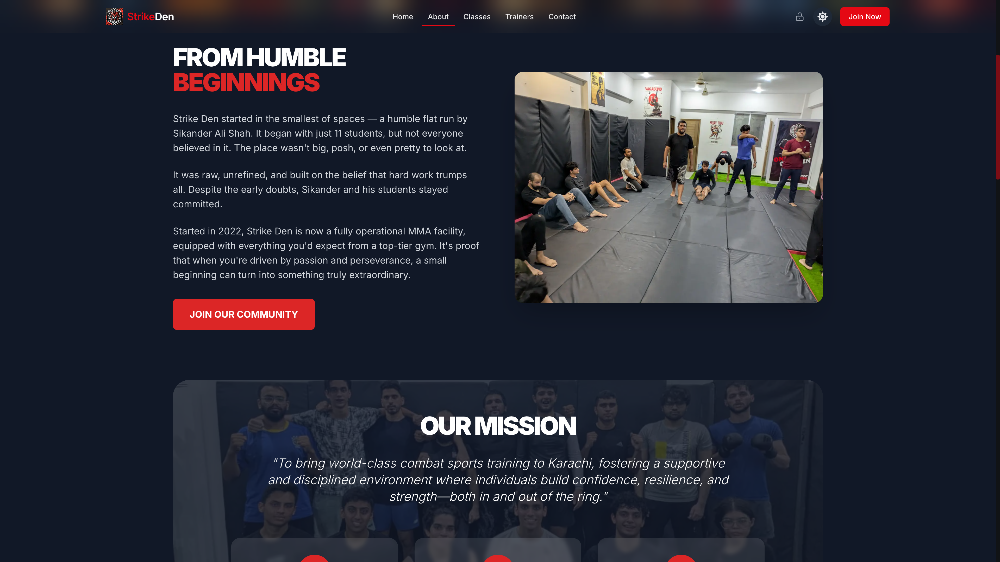
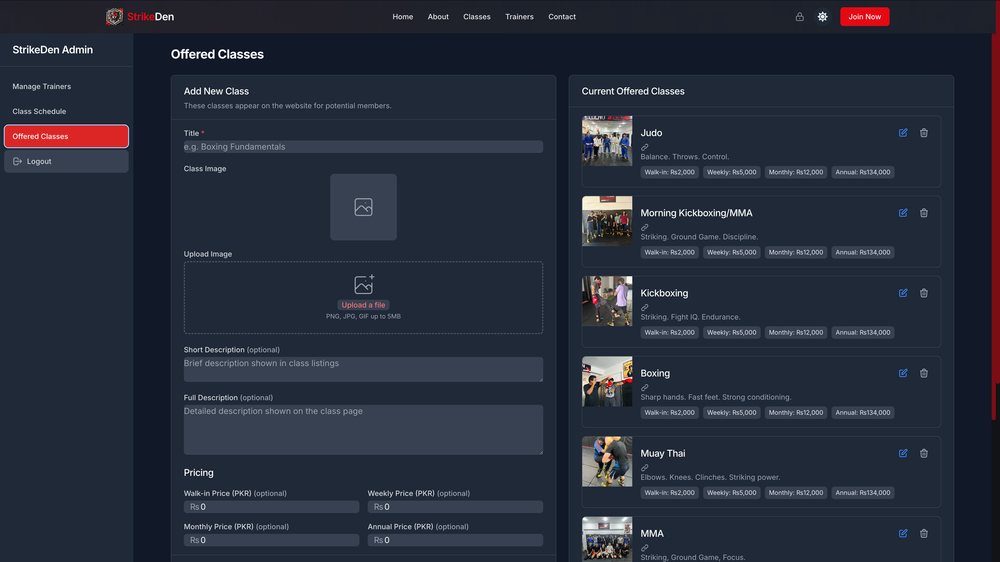

# StrikeDen — Where Champions Train

<p align="center">
  
</p>

<p align="center">
  🔗 <a href="https://strikeden.com">www.strikeden.com</a><br>
</p>

---

## The Story Behind This Project

I discovered StrikeDen in 2023 as an MMA student looking to get in shape—and found a family of dedicated fighters and coaches. After training there for four months, I had to leave for university, but stayed connected as the gym grew from a humble flat to a state-of-the-art facility in early 2024.

When I saw they were still managing everything via WhatsApp and Instagram DMs, I volunteered my web-dev skills to give back. What began as a simple scheduling helper evolved into this full-featured platform, keeping me—and the entire StrikeDen community—closely connected no matter where I am.

---

## What This Site Does

- **Class Schedule Management**  
  Trainers publish weekly classes; students browse availability in real time.  
- **Trainer Profiles**  
  Showcase each coach's bio, specialties, and credentials.  
- **Light/Dark Mode**  
  Seamless theme switch so you can check schedules anytime.  
- **Responsive Design**  
  Mobile-first layout for on-the-go access between sessions.  
- **Admin Dashboard**  
  Intuitive control panel for staff to manage classes, trainers, and content.  
- **Location Maps**  
  Integrated map helps newcomers find us in DHA Phase 6, Karachi.  

---

> **Note:** All screenshots below are shown in dark mode, but every screen can be switched to light mode for user preference.

## Frontend Screenshots

<details>
<summary><strong>Click to view screenshots of the frontend</strong></summary>

### Homepage


### Classes Slider


### Weekly Schedule


### About Page


### Trainers Page


</details>

## Admin Dashboard

<details>
<summary><strong>Click to view screenshots of the admin dashboard</strong></summary>

### Class Schedule Management


### Offered Classes Management


### Trainer Management


</details>

---

## Technical Highlights

### Sample Hook: Schedule Management
```javascript
// useSchedules.js — Custom React hook with optimistic updates
export const useSchedules = () => {
  // ...abstraction for fetch, delete, and rollback logic
};
```

### Core Features & Patterns
- JWT Authentication with HTTP-only cookies
- Role-Based Access Control (RBAC)
- MongoDB Transactions (ACID)
- Custom React Hooks for logic abstraction
- API Rate Limiting and brute-force protection
- Dynamic imports and ISR with Next.js
- Virtualized lists for performance
- Image optimization with Vercel Blob Storage

---

## Performance & Security

### Performance Enhancements
- Dynamic imports for admin components
- Incremental Static Regeneration (ISR)
- Custom data fetching with SWR-like patterns
- Virtual scrolling for large lists
- Tailwind JIT for minimal CSS bundle

### Security Measures
- Mongoose schema validation
- CSRF token enforcement
- Cryptographically secure password recovery
- Restrictive CSP headers
- Least-privilege DB access control

---

## Tech Stack
- Frontend: Next.js 15, React 19, Tailwind CSS, Framer Motion
- Backend: Node.js, MongoDB, Mongoose, JWT
- Media Storage: Vercel Blob
- Deployment: Vercel (Serverless Functions + Static Hosting)

---

## Codebase & Access

This repository is private.
For security reasons and to protect StrikeDen's proprietary content, detailed setup and deployment instructions have been intentionally omitted.
Feel free to contact me if you'd like a demo or technical walkthrough.

---

## Project Structure

```
StrikeDen/
├── app/           # Pages and API routes
│   ├── admin/     # Admin dashboard
│   ├── api/       # Backend endpoints
│   └── ...        # Other routes
├── components/    # Reusable UI components
├── lib/           # Database models and utility functions
├── public/        # Static assets
└── ...
```

---

## Lessons I Learned
- Balancing scope with user needs in real-world projects
- Building secure, scalable applications with MongoDB + Next.js
- Designing mobile-friendly admin UIs for non-technical users
- Using Vercel Blob for flexible media storage
- Managing real-time UX with optimistic updates and background syncing

---

<p align="center">
  Built with ❤️ by Khizar Aamir
</p>
